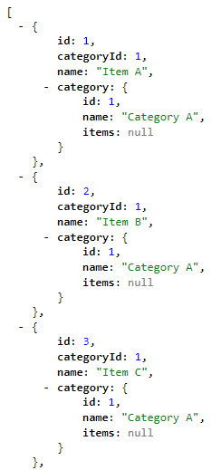
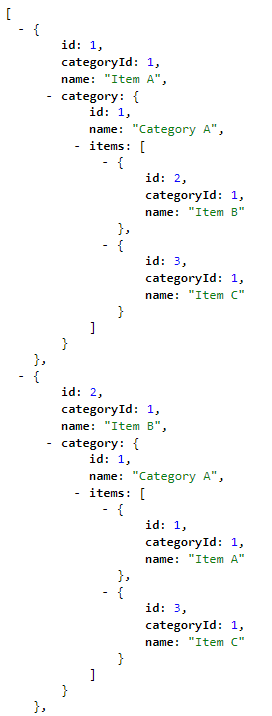

# Unrequested Data
This repo demonstrates my concerns with Entity Framework Core adding data to navigation properties that was not requested. It corresponds to this [GitHub Issue](https://github.com/aspnet/EntityFrameworkCore/issues/13577).

## Basic Setup

* `AppDbContext`, `Item`, and `Category` are all defined in the [**Data Access Layer**](./UnrequestedData.Data)
* Connection String is defined in [**appsettings.json**](./UnrequestedData.Web/appsettings.json)
* In `Startup.cs`, the serializer is configured with `options.SerializerSettings.ReferenceLoopHandling` set to `Ignore`.
* API routes are as follows:
    * `/api/item/getItems`
    * `/api/item/getMinimalItems`
* EF Queries are contained in [**ItemExtensions.cs**](./UnrequestedData.Web/Extensions/ItemExtensions.cs)

## Issue

When querying data from Entity Framework, the expected behavior when eager loading would be that only the data that was requested will be present in the data graph.

The following classes represent the entity model for this demonstration:

[**Item.cs**](./UnrequestedData.Data/Item.cs)  
[**Category.cs**](./UnrequestedData.Data/Category.cs)

The basic query for retrieving items with their category populated is as follows:

``` cs
public static async Task<List<Item>> GetItems(this AppDbContext db)
{
    var items = await db.Items
        .Include(x => x.Category)
        .OrderBy(x => x.Name)
        .ToListAsync();
    
    return items;
}
```

The expected output would look like [**getMinimalItems.json**](./getMinimalItems.json):



However, as the documentation states:

> Entity Framework Core will automatically fix-up navigation properties to any other entities that were previously loaded into the context instance. So even if you don't explicitly include the data for a navigation property, the property may still be populated if some or all of the related entities were previously loaded.

This means that by default, any data that was loaded by the query that ***COULD*** be filled into the data graph will be. As a result, the query actually returns the data structure shown in [**getItems.json**](./getItems.json):



As you will note, `ReferenceLoopHandling.Ignore` is working because it omits references to the base item in the `category.items` array. This behavior, however, is undesired because there is no way to prevent it from populating this data.

The only work around I've been able to find is to use the following for large datasets that would cause performance issues on the client side:

``` cs
public static async Task<List<Item>> GetMinimalItems(this AppDbContext db)
{
    var items = await db.Items
        .Include(x => x.Category)
        .OrderBy(x => x.Name)
        .ToListAsync();
    
    Parallel.ForEach(items, i =>
    {
        i.Category.Items = null;
    });

    return items;
}
```

I feel that having these navigation properties provided by default defeats the purpose of specifying the data that is included in the returned data structure. If I wanted the `item.category.items` array to be populated, I would have done the following:

``` cs
var items = await db.Items
    .Include(x => x.Category)
        .ThenInclude(x => x.Items)
    .OrderBy(x => x.Name)
    .ToListAsync();
```

At the very minimum, there should at least be a configuration option in Entity Framework to disable this behavior.